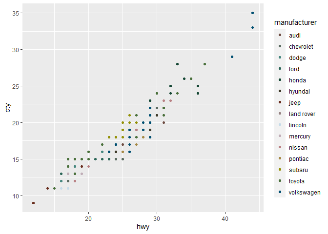
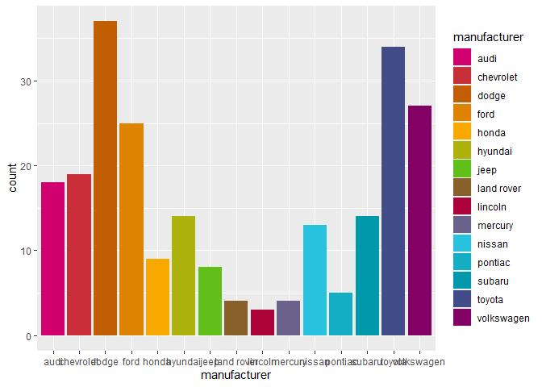
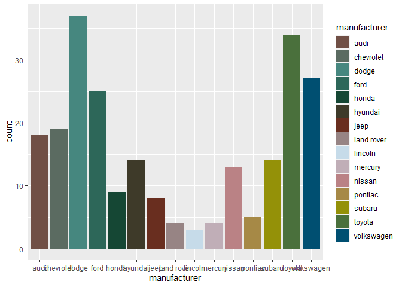

README
================
Jill MacKay
2023-07-19

# UoEColouR

A package of University of Edinburgh branded colours

Edinburgh brand colours taken from our
[Sharepoint](https://uoe.sharepoint.com/sites/Brand/SitePages/Colours.aspx).
I encourage any users to thoroughly read and understand brand guidance
prior to utilising Edinburgh colours.

With thanks to [Simon J’s post on writing your own ggplot
palette](https://drsimonj.svbtle.com/creating-corporate-colour-palettes-for-ggplot2).

## Examples

``` r
library(UoEColouR)
library(ggplot2)
```

You can browse a list of the Edinburgh colours with their approximate
names (I have added a precursor to all names to indicate the first
palette it belongs to)

``` r
ed_colours
```

    ##      university red     university blue         bright pink       bright orange 
    ##           "#D50032"           "#041E42"           "#D0006F"           "#C25E03" 
    ##       bright yellow        bright green          bright red         bright blue 
    ##           "#F9A800"           "#61BF1A"           "#AD033B"           "#29C2DE" 
    ##    bright blue blue       bright purple         muted brown     muted turquoise 
    ##           "#0099AB"           "#830065"           "#704F45"           "#46877F" 
    ##         muted green     muted red brown    muted light blue          muted pink 
    ##           "#154734"           "#692E1f"           "#c6dbe9"           "#BA8285" 
    ##        muted yellow          muted blue digital bright blue    digital burgandy 
    ##           "#949108"           "#004F71"           "#007288"           "#A50034" 
    ##        digital jade digital muted brown digital spruce grey     recruit pg blue 
    ##           "#487a7b"           "#6D4F47"           "#333F48"           "#004F71" 
    ##     recruit pg teal 
    ##           "#4a7875"

And then you can use the `scale_uoe` function with `ggplot2`

``` r
ggplot(aes(x = hwy, y = cty, colour = manufacturer ), data = mpg) +
  geom_point() +
  scale_colour_uoe()
```

<!-- -->

``` r
ggplot(aes(x = hwy, y = cty, colour = manufacturer ), data = mpg) +
  geom_point() +
  scale_colour_uoe(palette = "muted")
```

<!-- -->

``` r
ggplot(aes(x = manufacturer, fill = manufacturer), data = mpg) +
  geom_bar() +
  scale_fill_uoe()
```

<!-- -->

``` r
ggplot(aes(x = manufacturer, fill = manufacturer), data = mpg) +
  geom_bar() +
  scale_fill_uoe(palette = "muted")
```

<!-- -->
