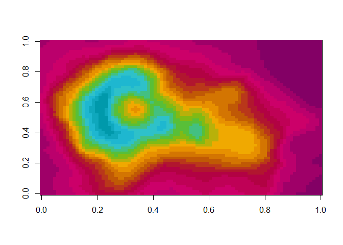

README
================
Jill MacKay
2023-07-20

# UoEColouR

A package of University of Edinburgh branded colours

Edinburgh brand colours taken from our
[Sharepoint](https://uoe.sharepoint.com/sites/Brand/SitePages/Colours.aspx).
I encourage any users to thoroughly read and understand brand guidance
prior to utilising Edinburgh colours. Namely, utilise these colours with
great care, especially as ramping colours by specifying more than a
palette’s length is probably in violation of said guidelines. However,
if you are producing internal reports for Edinburgh, you may find this
package useful.

With thanks to [Simon J’s post on writing your own ggplot
palette](https://drsimonj.svbtle.com/creating-corporate-colour-palettes-for-ggplot2).

## Examples

``` r
library(UoEColouR)
library(ggplot2)
```

The Edinburgh palettes are:

``` r
uoe_show_palette("core")
```

<!-- -->

``` r
uoe_show_palette("bright")
```

<!-- -->

``` r
uoe_show_palette("bright-two-tone")
```

<!-- -->

``` r
uoe_show_palette("muted")
```

<!-- -->

``` r
uoe_show_palette("muted-two-tone")
```

<!-- -->

``` r
uoe_show_palette("digital")
```

<!-- -->

``` r
uoe_show_palette("recruit-ug")
```

<!-- -->

``` r
uoe_show_palette("recruit-pg")
```

<!-- -->

``` r
uoe_show_palette("recruit-ug-core")
```

<!-- -->

``` r
uoe_show_palette("recruit-pg-core")
```

<!-- -->

Palettes can be utilised like so:

``` r
image(volcano, col = ed_col("bright", 20))
```

<!-- -->

And then you can use the `scale_uoe` function with `ggplot2`:

``` r
ggplot(aes(x = hwy, y = cty, colour = manufacturer ), data = mpg) +
  geom_point() +
  scale_colour_uoe()
```

<!-- -->

``` r
ggplot(aes(x = hwy, y = cty, colour = manufacturer ), data = mpg) +
  geom_point() +
  scale_colour_uoe(palette = "muted")
```

<!-- -->

``` r
ggplot(aes(x = manufacturer, fill = manufacturer), data = mpg) +
  geom_bar() +
  scale_fill_uoe()
```

<!-- -->

``` r
ggplot(aes(x = manufacturer, fill = manufacturer), data = mpg) +
  geom_bar() +
  scale_fill_uoe(palette = "muted")
```

<!-- -->
